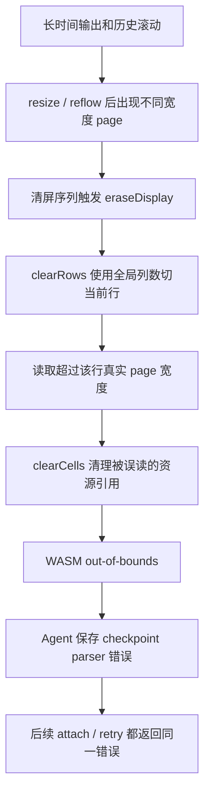

# Terminal Checkpoint Parser Failure Analysis

本文记录 2026-09-16 调查到的终端永久黑屏问题、根因判断、修复方案和验证边界。

实施状态：已移植行清理修复、重建共用 WASM，并将推荐 Agent 协议升级到 v23。前端与 Go 构建已通过。开发者更新后反馈原黑屏窗口恢复，且没有手动重启服务端，随后确认手工测试通过。实际运行中的 Agent 版本、进程是否变化及本次恢复路径尚未采证；该反馈不能证明旧进程热加载了新 WASM。本轮不包含失败 parser 的自动重建。

## 现象

受影响会话中，第一个 tab 左上角 pane 永久黑屏，右上角保持灰色呼吸点。当前前端重试无法恢复，换浏览器或设备进入同一会话也复现。

日志里的关键错误是 Agent 侧 checkpoint parser 持续返回：

```text
checkpoint parser failed: wasm error: out of bounds memory access
wasm stack:
.$148
.$242
.$240
.$274
.$324
.$457
```

前端诊断显示对应 pane 的浏览器 Worker 已启动且未进入本地 fatal 状态，但 `receivedCursor=0`、`appliedCursor=0`、`hasPresentedFrame=false`。这说明客户端没有拿到第一帧，问题不是离线占位或旧帧保持逻辑本身导致的。

服务端当前实现中，checkpoint parser 一旦进入错误状态，后续写入会直接返回已有错误；新客户端 attach 时也会因为同一个错误拒绝返回 snapshot。因此所有浏览器和设备都会继承同一个服务端错误现场，前端重试只能重复触发失败，不能救活会话。

## 已有证据

新旧日志对比显示，终端业务输出仍在继续，而 checkpoint parser 停在同一个失败状态：

| 项目 | 观察结果 |
| --- | --- |
| history cursor | 从 `681,379,511` 增加到 `709,911,794` |
| 增量输出 | 约 `28,532,283` bytes |
| skipped resize | 从 `400` 增加到 `2648` |
| WASM memory | 保持 `19,005,440` bytes |
| last recorded resize | 保持在 `1789524699563`，即 2026-09-16 10:11:39.563 +08:00 |
| wasm stack | 多次报告完全一致 |

诊断日志里首次观测到的错误时间是 2026-09-16T03:21:10.002Z。后续数秒内的多次相同报告是连接重试读到同一个已保存错误，不代表每次都发生了新的崩溃。

使用带符号的 ReleaseSmall 构建映射线上函数编号后，线上栈对应：

```text
.$148 = RefCountedSet(style...).release
.$240 = Screen.clearRows
.$242 = Screen.clearCells
.$274 = Terminal.eraseDisplay
.$324 = stream parser
.$457 = ghostty_terminal_write
```

这条栈指向 “处理清屏序列时 clearRows/clearCells 越界读取行 cell，并在释放样式资源时访问了非法状态”。

## 根因判断

当前仓库固定的 Ghostty 版本中，`ghostty-web/ghostty/src/terminal/Screen.zig` 的 `clearRows` 使用当前 PageList 的全局列数来切分每一行：

```zig
const cells_multi: [*]Cell = row.cells.ptr(chunk.node.data.memory);
const cells = cells_multi[0..self.pages.cols];
```

问题在于 resize/reflow 之后，页面列表里可能短暂或长期存在不同宽度的历史 page。某一行实际所在 page 的宽度可能小于当前 `self.pages.cols`。这时 `clearRows` 会把一行切成过长的 `cells`，`clearCells` 随后把相邻内存解释成 cell。如果相邻内存被误判成带 style/grapheme/hyperlink 的 cell，释放资源时就可能访问无效 id，最终触发 WASM out-of-bounds。

这个路径和线上栈完全对齐：`eraseDisplay` 调用 `clearRows`，`clearRows` 进入 `clearCells`，`clearCells` 清理 style 引用，最终在 style ref-count release 中触发越界。

可以把故障链路简化为：



历史上限会提高复现概率，但不是因为 `N * 350 bytes` 裁剪策略本身错误。长历史、频繁输出、resize/reflow 和清屏序列组合在一起，更容易让 mixed-width page 状态出现，并让旧的 `clearRows` 走到越界路径。

## 历史上限审计结论

当前三层历史上限不是同一个物理计数器，但整体符合设计意图：

| 层 | 当前行为 |
| --- | --- |
| Agent 原始历史字节 | 按 `historyLimitBytesForTerminalScrollback(N) = N * 350` 裁剪，这是预期行为 |
| 浏览器可见 scrollback | 暴露 `min(WASM raw history, logicalScrollbackLimit)`，可见行数受终端设置限制 |
| Ghostty WASM 内部历史 | 按估算字节容量保留，容量大约来自 `(N + rows) * (cols + 64) * 16 + 512KiB`，并随更宽几何或更大设置增长 |

因此，用户设置的历史行数并不等价于 WASM 内部所有 page 都严格只有 N 行。这个差异本身不是故障根因，但高历史上限会让相关状态更容易被保留到清屏路径。

另一个边界是：已存在的前端终端如果运行中修改 scrollback 设置，目前只更新 `term.options.scrollback`，没有同步更新 native logical limit。新 session 或 checkpoint restore 会使用新的限制。

## 直接修复方案

直接修复应移植 Ghostty upstream commit：

```text
e727a36589dffa5b42f76e83d260a5617cdde54e
terminal: clear rows using stored page width
https://github.com/ghostty-org/ghostty/commit/e727a36589dffa5b42f76e83d260a5617cdde54e
```

该修复的核心是：`clearRows` 不再用全局 `self.pages.cols` 切当前 row，而是用 row 所属 page 自己的宽度和访问方法。

在本仓库当前代码结构下，修复点应是：

```zig
const page = &chunk.node.data;
const cells = page.getCells(row);
```

并且调用清理函数时传入同一个 `page`。同时，`clearCells` 中判断整行 managed-memory 标志时，使用 `page.size.cols`；`clearUnprotectedCells` 通过调用同一个 `clearCells` 复用该修正。

本轮已落地：

1. 新增 `tools/ghostty-clear-rows-stored-width.patch`，记录 upstream 来源并适配当前版本的页面访问接口。
2. 将补丁加入 `tools/build-ghostty-wasm.sh`，位于现有 reflow/capacity patch 之后、checkpoint/render/resize diagnostics patch 之前；后续重建自动包含修复，构建结束仍还原子模块源码。
3. 执行 `tools/sync-ghostty-web-assets.sh --rebuild-wasm-only`，同步源构建产物和 `runtime/static/ghostty-vt.wasm`，保留现有定制 JavaScript。
4. 将 `agent.go` 的 `agentProtocolVersion` 提升到 `lcmd-webshell-agent-v23`，在 `agent_runtime.go` 显式保留 v22 至 v9 的传输兼容，更新两处协议说明。旧 Agent 仍只在用户明确更新时替换。
5. 保留前一轮新增的前端诊断能力，用于之后观察是否仍有新的 checkpoint parser 错误类型。

浏览器展示用 WASM 和 Agent checkpoint parser 都需要包含该修复，才能覆盖两端的对应路径。Agent 通过 `go:embed` 在编译时嵌入 WASM；替换磁盘上的静态文件不会修改正在运行的旧 Agent。开发者报告更新后窗口恢复，但这次恢复的具体路径尚未确认，不能从画面恢复反推旧 Agent 已更新。

## 本地验证状态

修复前随包 WASM 的哈希：

```text
runtime/static/ghostty-vt.wasm
sha256 74b91404aaa8f357df5996ed1dbfa762a7bdfc2209ef4ec8eac576332a71824f
```

调查阶段曾在临时目录移植 upstream 修复并成功构建 ReleaseSmall WASM。本轮通过正式构建脚本得到相同哈希：

```text
sha256 dfab4f719f16f4212147fc015d537ab8b6f540d5cb4b68c7119b857494bf5ff3
```

调查阶段的本地 smoke workload 覆盖了带 style 的长历史、缩窄 resize、清屏模式 `[J` / `[1J` / `[2J` / `[3J` 和后续输出，修复后通过。本轮产物与该候选产物逐字节一致；未重新执行这一工作负载。

尝试运行完整 upstream Zig test 时，主机环境在 GTK blueprint 相关依赖处出现无关 linker 错误 `R_X86_64_PC64`，因此没有把完整 upstream test 结果作为本结论依据。

本轮实际完成的验证：

- WASM 重建及源资产同步通过；构建后两个子模块的工作树均干净。
- `npm run build` 通过，Vite 发布资产检查通过；发布包中的 WASM 与 Agent 编译时嵌入的源文件哈希一致。
- `go build -o build/webshell .` 通过；本地 `build/webshell agent version` 返回 `lcmd-webshell-agent-v23`，该命令只读取版本，不启动 daemon。
- 新 WASM 在 JavaScript 引擎中编译、实例化成功；与修复前相比，导入/导出接口保持一致，checkpoint stack 导出存在。
- 补丁应用检查、构建脚本语法检查、Go 格式检查与 `git diff --check` 通过。
- 后续使用修复后的 WASM 和随包 JavaScript wrapper 完成普通 ASCII 回归：历史上限 10000，写入十万条、共 4.5 MB，约 0.78 秒，未报错；可见历史为 10000 行，首尾历史可读，后续完成标记可见。这是按相同规模进行的回归，并非原测试输入的逐字节重放；此前两组组合字符故障场景未重跑，仍为未验证。

未新增自动测试或改写既有 AC。当前修复维护 `terminal/state-checkpoint` 和 `terminal/resize-sync` 已描述的恢复与跨窗口使用结果。开发者已确认手工测试通过，原黑屏窗口恢复；这不等同于已重放线上原始故障或覆盖所有组合字符场景。

## 后续回归边界

后续产品回归应在独立测试会话中检查正常长历史浏览、窗口尺寸变化、重新进入会话及后续输入输出，并保留前后端版本和运行进程信息，使画面恢复与具体生效版本能够关联。

修改运行中会话的历史设置不会完整收缩 native 侧已有容量；比较不同历史设置时，需要明确会话创建时使用的配置。

## 边界和后续

移植 upstream 修复可以直接覆盖当前线上栈指向的故障路径，置信度高。它不等价于证明所有 checkpoint parser 错误都不存在，也不处理调查中发现的另一个组合字符相关本地问题。

“丢弃失败 parser、用可信历史重新构造新 parser”的自愈方案仍有价值，但应作为第二阶段防御能力。当前补丁修正与线上调用栈相符的行清理缺陷；parser 自愈需要另行验证恢复来源与状态完整性，不能仅凭本次窗口恢复认定已经具备。
